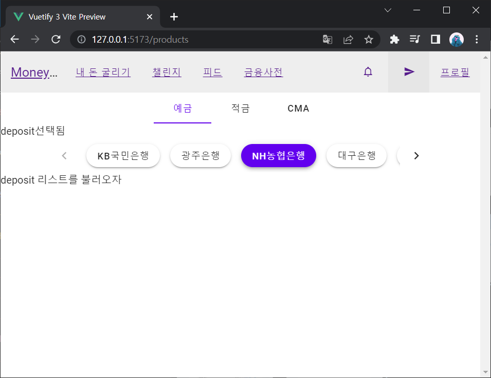
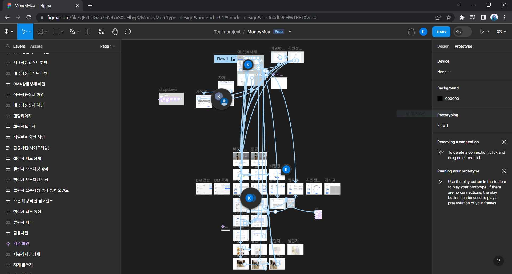

## 20230720 신경희 작업내역

### 1. Vue.js

#### Vuetify


[테스트 프로젝트 생성](https://lab.ssafy.com/skh1615/vue3test)

#### Router

- [Lazy Loading](https://sunny921.github.io/posts/vuejs-router-05-lazyloading/) 최초 로딩시간을 줄이기 위해 하위기능에 lazy loading 적용 필요

#### Composition API

- &lt;script setup&gt;에서 컴포넌트 등록하기
  ```
  <script setup>
      import MyComponent from './MyComponent.vue'
  </script>
  <template>
      <MyComponent />
  </template>
  ```
  SFC사용 시 별도 등록 절차 없이 로컬로 사용 가능  
  로컬로 등록된 컴포넌트는 자식 컴포넌트에서 사용할 수 없음  
  파일 이름을 기반으로 자동으로 name옵션을 추론하므로, `export default{}`를 통해 지정해줄 필요 없음

### 2. 피그마 프로토타입

#### 페이지 인터랙션


