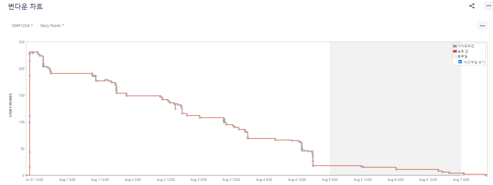

# 🔥 프로젝트 개요

프로젝트 기간: 2023.07.04 ~ 2023.08.18 <br> 

어려운 예적금 재테크 쉽게하자 <br>
금융 SNS, 예,적금 계산기 MoneyMoa

<br><br><br>

# 🙂 개발 멤버 소개

<table>
    <tr>
      <td align="center">
        <h5>정원균</h5>
      </td>
      <td align="center">
        <h5>신경희</h5>
      </td>
      <td align="center">
        <h5>강노아</h5>
      </td>
      <td align="center">
        <h5>이상혁</h5>
      </td>
      <td align="center">
        <h5>권종률</h5>
      </td>
      <td align="center">
        <h5>공익규</h5>
      </td>
    </tr>
    <tr>
        <td height="140px" align="center"> <a href="https://github.com/Jungwonkyun">
             <br>Team Leader, BE Leader</a></td>
        <td height="140px" align="center"> <a href="https://github.com/gwame">
             <br>FE Leader</a></td>
        <td height="140px" align="center"> <a href="https://github.com/Noah-kang">
             <br>BE</a></td>
        <td height="140px" align="center"> <a href="https://github.com/LeeSanghyuk36">
             <br>BE</a></td>
        <td height="140px" align="center"> <a href="https://github.com/KwonJongryul">
             <br>FE</a></td>
        <td height="140px" align="center"> <a href="https://github.com/Going9">
             <br>FE</a></td>        
    </tr>
    <tr>
      <td align="center" style="padding: 0px">
        인프라 구축<br>BE 개발환경 구축<br>회원관리 & 웹채팅 구현
      </td>
      <td align="center">
        FE 개발환경 설정<br>금융상품&웹채팅 구현<br>UX/UI
      </td>
      <td align="center">
        예,적금,CMA기능 구현<br>S3 환경설정<br>ucc제작
      </td>
      <td align="center">
        BE Jira 관리<br>피드 구현<br>서비스 기획
      </td>
      <td align="center">
        계정관리&금융사전 구현<br>FE Jira 관리<br>UX/UI
      </td>
      <td align="center">
        유저정보&챌린지 구현<br>기획 문서<br>UX/UI
      </td>    
    </tr>
</table>

<br>
<br>
<br>

# 📜 MoneyMoa 개요

한화 이글스 적금, 부산 월드엑스포 적금, 진짜 사나이 적금 등등 별의 별 상품이 쏟아져 나오는 지금 어떤 예적금을 들어야 할지 고민이 많으신가요? <br>
<br>
이자 계산은 저희가 할게요! 원하는 상품을 자유롭게 선택해주세요 <br><br>
꾸준히 저축하기 힘드시죠? 첼린지 기능과 돈을 예치할 때 마다 작성하는 피드로 성취감을 얻을 수 있습니다. 

<br>
<br>

# 📦 서비스 구조도

 

<br>
<br>

# 🌊 erd

 

<br>
<br>

# 🛠️ 서비스 기능

- 일반 로그인 외에도 네이버, 카카오 소셜 로그인
- 예,적금 cma 이자 계산기 
- 챌린지 및 피드 생성 
- 소켓 프로그래밍을 통한 웹 오픈단체 채팅, Direct Message
- 어려운 금융 옹어를 쉽게, 금융 위키 

<br>
<br>

# 🔧 주요 기술

### 🖱️Backend

- IntelliJ
- spring boot 
- spring-boot-jpa
- Spring Security
- redis 
- Mongo DB
- Java 11
- mariaDB
- WebSocket

### 🖱️Frontend

- Visual Studio Code
- Vue.js 3 , Vite
- Node.js 
- Vuetify
- Vuex
- SaaS
- Webstomp-Client 1.2.6
- Sock.js-Client 1.6.1

### 🖱️CI/CD

- AWS EC2
- docker
- nginx
- jenkins
- Amazon s3

### 🖱️협업 툴

- Git
- Jira
- Mattermost
- Discord

### 🖱️기타 편의 툴

- postman
- swagger

<br>
<br>

# 📺 서비스 화면

### 로그인 & 회원가입


### 메인페이지


### 상품정보


- 예금 상품 목록


- 상품 상세 (우대 이율 옵션 토글)


- CMA 상품 목록


- CMA 상세 조회

### 오픈채팅


### 챌린지 피드


### 금융 위키


<br>
<br>

# Jira 번다운 차트



<br>
<br>

# Figma 기획


<br>
<br>

# 📁 폴더 구조

### Backend

```
MoneyMoa/
├── api/
│   ├── config
│   ├── controller
│   ├── domain
│   │   └── general
│   │   └── kakao 
│   │   └── naver
│   │   └── oauth
│   │   └── redis
│   ├── dto 
│   ├── exception 
│   ├── repository 
│   ├── response 
└── └── service
```

### Frontend

```
MoneyMoa /
├── node_modules
├── public
└── src/
    ├── api
    ├── assets/
    │   ├── css
    │   ├── fonts
    │   └── images
    ├── components
    ├── plugins
    ├── router
    ├── stores
    ├── views
    └── main.js
```
